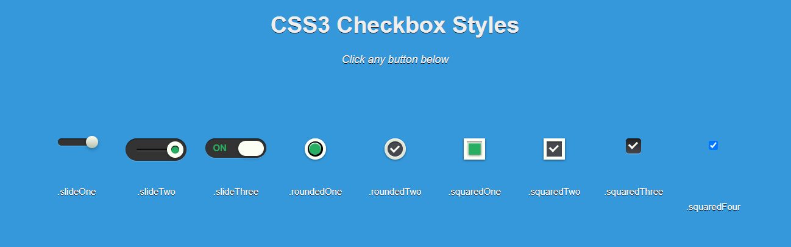

# Checkbox Personalizados con CSS3



Este repositorio contiene un conjunto de estilos personalizados para checkboxes utilizando solo HTML y CSS3, sin necesidad de JavaScript.

## Características
- Diferentes estilos de checkboxes con animaciones.
- Uso exclusivo de CSS para la personalización.
- Fácil integración en cualquier proyecto web.

## Instalación
Para clonar este repositorio y usar los estilos en tu proyecto, sigue estos pasos:

```bash
# Clona el repositorio
git clone https://github.com/lenninIbarrraGonzalez/checkboxstyles

# Accede al directorio del proyecto
cd tu-repositorio
```

## Uso
1. Copia el archivo `style.css` en tu proyecto.
2. Asegúrate de enlazar el archivo CSS en tu documento HTML:

```html
<link rel="stylesheet" href="style.css">
```

3. Usa las clases en tus checkboxes como se indica en el archivo `index.html`.

## Estructura del Proyecto
```
/
├── index.html   # Archivo principal con los checkboxes
├── style.css    # Estilos personalizados en CSS3
├── README.md    # Documentación del proyecto
```

## Contribuciones
Si deseas mejorar este proyecto, puedes hacer lo siguiente:
1. Haz un fork del repositorio.
2. Crea una nueva rama con tus cambios:
   ```bash
   git checkout -b mi-nueva-funcionalidad
   ```
3. Realiza tus modificaciones y haz un commit:
   ```bash
   git commit -m "Añadida nueva funcionalidad"
   ```
4. Sube los cambios a tu repositorio:
   ```bash
   git push origin mi-nueva-funcionalidad
   ```
5. Abre un Pull Request en este repositorio.

## Licencia
Este proyecto está bajo la licencia MIT. Puedes usarlo y modificarlo libremente.

---

¡Gracias por usar este código! 😊


